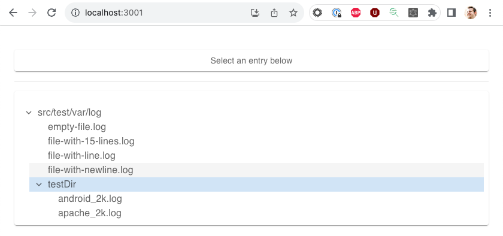
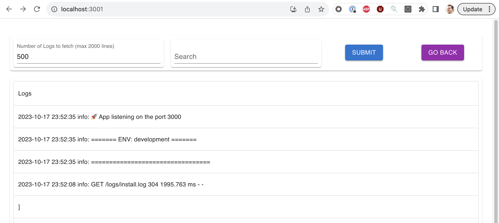
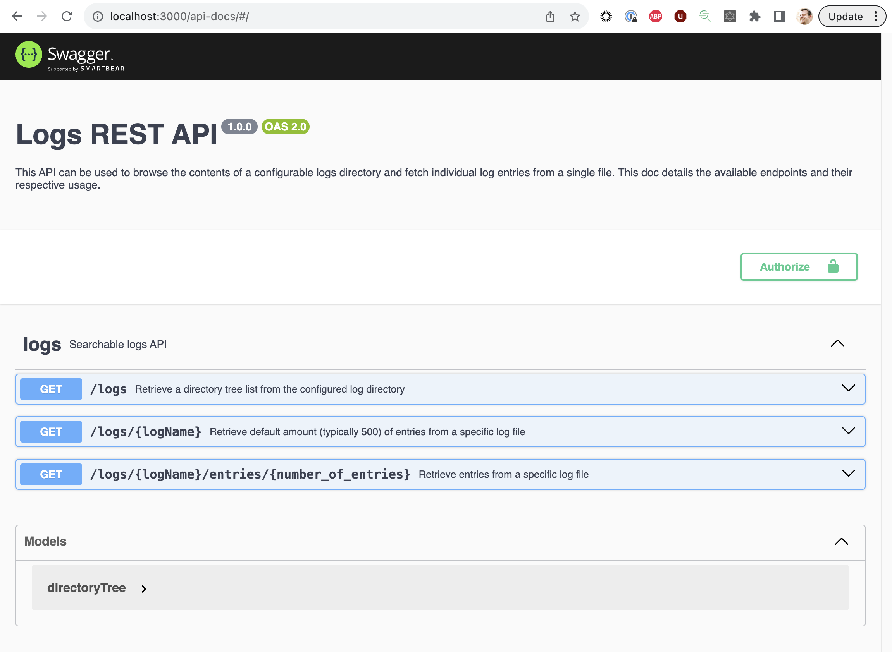

# Log Collection API

## Objective

> A customer has asked you for a way to provide on-demand monitoring of various unix-based servers without having to log into each individual machine and opening up the log files found in `/var/log`. The customer has asked for the ability to issue a REST request to a machine in order to retrieve logs from `/var/log` on the machine receiving the REST request.

This repo contains a [backend Express API](./backend) and [frontend React app](./frontend), both written in TypeScript. These projects were independently bootstrapped with starter templates, so there's a mix of some opinionated tooling throughout that leads to some nice developer ergonomics. There's still a bit more that could be accomlished to make this into a turn-key deployable app (namely a Dockerfile), but it's quite usable for a local dev environment today.

### Acceptance criteria

The main theme of the acceptance criteria had to do with building a REST API that could retrieve log lines from a given file. In the backend app, there are 3 endpoints available that satisfy these requirements:

```bash
# Returns a tree of nodes representing the directory tree at backend/src/test/var/log (this path is hard-coded in local backend/.env and frontend/.env files).
/logs

# Retrieves a log by name. By default we only return 500 lines, and at max 2000.
/logs/:logName
example: /logs/2023-10-17.log

# Retrieves a log by name along with the specified number of entries. By default we only return 500 lines, and at max 100000.
/logs/:logName/entries/:entries
example: /logs/2023-10-17.log/entries/500

# Plain-text search - via `search` query parameter
/logs/:logName/entries/:entries?search=<search_string>
example: /logs/2023-10-17.log/entries/100?search=🚀
```

### External Dependencies and the scheme behind searching through files

The actual loading and searching through files is limited to using Node built-ins (primarily the `fs` module). The main implementation for searching throught the file is contained in [utils/readFileLines.ts](./backend/src/utils/readFileLines.ts).

## Usage

**NOTE: Start the backend app first. It runs on port 3000 and the frontend is configured to send traffic to that port via the [proxy setting in package.json](https://github.com/jbeveland27/log-collection-api/blob/main/frontend/package.json#L32).**

### Development

```bash
git clone https://github.com/jbeveland27/log-collection-api.git
cd log-collection-api

# install dependencies
cd backend && npm install ; cd ../frontend && npm install;

# Copy .env.sample to .env.development.local and change any needed vars if desired
cp .env.sample .env.development.local

# run backend and frontend together
# NOTE: Start the backend first. It runs on port 3000 and the frontend is
# configured to send traffic to that port via the proxy setting in package.json

# Open 2 terminal windows and run:
# backend - defaults to port 3000 (backend/.env file setting)
npm run dev

# frontend - defaults to port 3001 (frontend/.env file setting)
npm start
```

Visit <localhost:3001>. The contents of `backend/src/test/var/log` _should_ display in a directory tree list. Clicking a log entry will then display the most recent 500 lines (Note: at the moment only `utf8`-encoded files will display accurately). Using the search filters will refetch data from the API (rather than run client-side filtering on the fetched data).





### Env

In the prevoius section, it was mentioned to copy the `.env.sample` file and modify as needed for your setup. Pay special attention to the value of `API_LOG_DIR`, and ensure the corresponding value of `REACT_APP_API_LOG_DIR` in `frontend/.env` is set to the same value. This should make it so the UI and backend use a consistent directory for viewing and querying.

By default, this value is set to `src/test/var/log` to use the sample logs included with this repo.

### Testing

There are also some Jest tests included:

```bash
# Run all tests
npm run test

# Run tests continuously
npm run test:watch

# Coverage test
npm run test:coverage
```

### Postman

I tested the API with Postman locally, and included a Collection of these requests so they can be imported for others to use. This Collection is available in the [postman](./postman/) directory.

**Note**: The API is hard-coded to look in `backend/src/test/var/log` for files. Modify your local `backend/.env` if you have files stored elsewhere you want to use with the API. Also, you will need to modify the `:logName` path param in the requests to match files that are on your local filesystem.

### Swagger / OpenAPI

The backend API is also documented with a Swagger / OpenAPI doc and can be used for testing. To use, run the backend app and visit <localhost:3000/api-docs>.



## Possible future items

* More robust testing of backend
* Production Build script / Dockerfile
